**Java Full Stack Developer** · Spring Boot · Angular · AWS · AI integrations

---

## 👨‍💻 About Me

I'm a **Java Full Stack Developer** who builds production-ready applications end to end — from REST APIs and data models on **Spring Boot**, to responsive **Angular** interfaces, to deployment on **AWS**.

- 🔭 Currently building **Marathon Bib Expo**, an event-operations platform for marathon organisers, with an AI agent on top
- 🤖 Integrating LLMs into real products with **Spring AI, LangChain, LangGraph and MCP**
- 🌱 Going deeper into **system design, Kafka, concurrency and distributed systems**
- 🏅 **AWS Certified Cloud Practitioner**
- 💬 Ask me about **Spring Boot, Angular, REST API design, or AI agents**

---

## 🛠️ Tech Stack

<table>
  <tr>
    <td width="130"><b>Backend</b></td>
    <td>
      
      
      
      
      
      
      
      
    </td>
  </tr>
  <tr>
    <td><b>Frontend</b></td>
    <td>
      
      
      
      
      
      
      
    </td>
  </tr>
  <tr>
    <td><b>Databases</b></td>
    <td>
      
      
      
    </td>
  </tr>
  <tr>
    <td><b>Cloud & DevOps</b></td>
    <td>
      
      
      
      
    </td>
  </tr>
  <tr>
    <td><b>AI & Python</b></td>
    <td>
      
      
      
      
      
      
    </td>
  </tr>
</table>

---

## 🚀 Featured Projects

### 🏃 Marathon Bib Expo
An event-operations platform for marathon organisers — bib distribution, participant and inventory management, goodie tracking and reporting — with an AI assistant that works on live event data.

- **Core service:** Spring Boot modular monolith with JWT security, CSV bulk import via Spring Batch, and an audit trail built with Spring AOP
- **Messaging:** SMS & WhatsApp campaign engine with configurable providers
- **AI agent:** FastAPI + LangChain/LangGraph agent calling the core through Spring MCP tool endpoints (e.g. participant lookup by bib number)
- **Frontend:** Angular + PrimeNG + Tailwind CSS

  
  

### 🎙️ InterviewGenius
An AI interview-practice app built as **8 Spring Boot microservices** with MySQL and an Angular 18 + PrimeNG frontend, using **Spring AI** with OpenAI — including voice chat.

  

### 🧩 LeetCode Solutions
My problem-solving practice — data structures, algorithms and interview patterns.

  

---

## 📊 GitHub Stats

---

## 🐍 Contribution Snake

  <picture>
    <source media="(prefers-color-scheme: dark)" srcset="https://raw.githubusercontent.com/s-banerjee94/s-banerjee94/output/github-contribution-grid-snake-dark.svg" />
    <source media="(prefers-color-scheme: light)" srcset="https://raw.githubusercontent.com/s-banerjee94/s-banerjee94/output/github-contribution-grid-snake.svg" />
    
  </picture>

---

**Open to full-stack roles and interesting collaborations — let's connect!**

  

